<div align="center">


# Your Second Brain: The First Multimodal Knowledge Visualisation & Semantic Retrieval Framework

<div align="center">
        
</div>

<div style="background: linear-gradient(135deg, #0b0d12 0%, #161b25 50%, #1e2432 100%); border-radius: 14px; padding: 18px; margin: 18px auto; max-width: 980px; border: 1px solid rgba(122, 134, 200, 0.38); box-shadow: 0 0 24px rgba(89, 102, 171, 0.18);">
        <p>
                <a href="https://github.com/officialadityadesai/yoursecondbrain/tree/main">
                        
                </a>
                <a href="https://ai.google.dev/gemini-api/docs/embeddings">
                        
                </a>
                <a href="https://lancedb.com">
                        
                </a>
        </p>
        <p>
                <a href="https://www.python.org/downloads/">
                        
                </a>
                <a href="https://vite.dev/">
                        
                </a>
                <a href="https://fastapi.tiangolo.com/">
                        
                </a>
                <a href="https://ffmpeg.org/">
                        
                </a>
        </p>
        <p>
                <a href="https://support.claude.com/en/articles/10949351-getting-started-with-local-mcp-servers-on-claude-desktop">
                        
                </a>
                <a href="https://opensource.org/license/mit">
                        
                </a>
        </p>
</div>

</div>

<div align="center">
        <div style="width: 100%; height: 2px; margin: 24px 0; background: linear-gradient(90deg, transparent, #6E78BF, transparent);"></div>
</div>

## 🎯 The Problem

**Hitting your AI/API usage limits mid-conversation and losing context about everything is a problem you can't avoid...** Until now. You have a confusing dump of **files scattered everywhere**: PDFs, Word docs, images, videos, notes, etc. Every time you want to ask an AI a question or request about those files, you re-upload the same context, prompts, and files over and over again. Your scarce token budget bleeds away. You can't see how the files relate. You risk hallucinations and context rot with every message you send. You're trapped in a cycle of re-uploading, re-explaining, and re-sending.

**With "Your Second Brain", these will be problems of the past.**

## 💡 Core Idea

**Upload your files once**. 
The framework:
- **Centralises** them in a unified multimodal local vector database
- **Understands** them semantically across all modalities (text, images, video, documents, etc)
- **Lets you steer memory formation** with upload context labels that shape embeddings and retrieval intent from day one
- **Visualises** relationships, ideas, and entities in an interactive nodal knowledge graph
- **Protects memory quality** with duplicate-name and duplicate-content blocking before ingest
- **Self-heals old knowledge** using startup backfills that enrich missing entities and video transcripts automatically
- **Retrieves** grounded answers and information only from your knowledge with neuron-level evidence
- **Integrates** with Claude MCP to find hidden information in files, retrieve trimmed timestamp-precise video clips, and get grounded answers from your knowledge base
- **Supports dual chat intelligence** with both Gemini and connected Claude account modes in-app

This is a **generously feature-rich free framework that you can adapt** to your projects, workflows, product development, knowledge management, customer support, personal learning, and team collaboration initiatives. In practice, this means local, unlimited ingestion, a unified multimodal semantic space, node-focused knowedge visualisation, token-efficient retrieval assembly, and Claude MCP as a native memory interface with source-based answers.

## 🏗️ How It Works

```mermaid
%%{init: {'theme': 'base', 'themeVariables': {'primaryColor': '#1F2535', 'primaryTextColor': '#D7DBF4', 'primaryBorderColor': '#6E78BF', 'lineColor': '#7E6FAF', 'secondaryColor': '#181C27', 'tertiaryColor': '#12151C', 'background': '#0B0D12'}}}%%
flowchart LR
                Q[Your Files & Questions]:::entry

                subgraph S1[Stage 1: Ingestion]
                        U1[Upload Panel / brain_data folder]
                        U2[File Router by Type]
                        U3[Parse & Chunk]
                        U1 --> U2 --> U3
                end

                subgraph S2[Stage 2: Understanding]
                        E1[Semantic Embeddings]
                        E2[Entity & Topic Extraction]
                        E3[Video Transcription]
                        E1 --> E2
                        E1 --> E3
                end

                subgraph S3[Stage 3: Memory]
                        K1[Vector Index]
                        K2[Knowledge Graph]
                        K3[Citation Metadata]
                        K1 --> K2
                        K1 --> K3
                end

                subgraph S4[Stage 4: Retrieval & Action]
                        R1[Semantic Search]
                        R2[Chat with Citations]
                        R3[Claude MCP Tools]
                        R1 --> R2
                        R1 --> R3
                end

                Q --> U1
                U3 --> E1
                E2 --> K1
                K2 --> R1

                classDef entry fill:#2A3150,stroke:#8B79C4,color:#E6E9FF,stroke-width:2px;
```



**Process:**
1. Upload files (documents, images, videos) once.
2. System parses them, generates semantic embeddings, and extracts entities, topics, and ideas.
3. Everything is indexed and connected in a multimodal nodal knowledge graph.
4. Ask questions, and get answers grounded in your actual files with citations.
5. Use Claude MCP to extend it into your current AI operations.

## ✨ Core Capabilities

<div style="background: linear-gradient(135deg, #12151f 0%, #1d2230 100%); border-radius: 14px; padding: 22px; margin-top: 10px; border-left: 4px solid #6E78BF;">

- **🔄 Multimodal Ingestion**: Text, PDFs, Word docs, images, and videos - one unified pipeline
- **🧭 Context-Steered Ingestion**: Attach optional upload context per batch so the system indexes files with your intended meaning alongside raw content
- **🛡️ Memory Integrity Controls**: Duplicate filename and exact content-hash blocking keeps your graph clean and non-redundant
- **⛓️ Queue-Safe Processing**: Serialised ingestion with queued/processing/done states prevents rate-limit spikes and keeps ingestion stable at scale
- **🧠 Knowledge Graph Visualization**: See relationships between files and concepts in an interactive Obsidian-style nodal graph
- **🕸️ Entity Relationship Intelligence**: Auto-extracted people, organisations, tools, concepts, and explicit relationships are linked across files
- **🔍 Semantic Retrieval**: Find relevant content by meaning and keyword signals across all file types
- **🧾 Holistic Retrieval Engine**: Semantic search, keyword exact matches, full-file reconstruction, and topic-neighbour expansion in one retrieval flow
- **📝 Citation-Grounded Answers**: Chat interface returns answers with linked sources and citations
- **🤝 Claude MCP Integration**: The app becomes your second brain. Claude is your voice - search by description, retrieve timestamp-precise clips, trace connections, and get grounded answers from your entire knowledge base in chat
- **🔁 Self-Healing Enrichment**: On startup, the system backfills missing entities/transcripts for previously ingested files
- **⚡ Token Optimization**: Intelligent chunking, context blending, and retrieval discipline to minimise token waste and limit usage
- **🎬 Video-Aware Retrieval**: Transcript timestamps, semantic line matching, and dense-window clip selection produce evidence-precise playable clips
- **🔒 Private by Design**: Everything stays local - no re-uploading, no external indexing

</div>

This framework is adaptable across research, engineering docs, customer support, personal knowledge management, team collaboration, media analysis, and compliance-heavy workflows where persistent multimodal retrieval and explainable evidence matter.

### 🧩 Additional Power Features Already In The App

- **Interactive graph control surface**: tune node distance, center force, repel force, link thickness, and label visibility in real time
- **Persistent graph state**: layout and graph settings are saved and restored between sessions
- **Shareable node deep-links**: open specific knowledge nodes directly via URL path/query links
- **Rich multimodal preview layer**: PDF, DOCX (HTML conversion), image, and video previews in a single modal workspace
- **Evidence explorer UX**: citations open source previews with highlighted quotes for rapid verification

## 🚀 Quick Start

### Prerequisites

- Python 3.10+
- Node.js 18+
- Gemini API key: https://aistudio.google.com/app/apikey
- FFmpeg available on PATH (required for video clipping)

If you do not have these installed yet, use the quick setup below.

### Install prerequisites (Windows)

1. Install Python 3.10+:
        - Download from: https://www.python.org/downloads/windows/
        - During install, tick **Add Python to PATH**.

2. Install Node.js 18+:
        - Download LTS from: https://nodejs.org/en/download

3. Install FFmpeg (for video clip generation):
        - Easiest: install via winget in PowerShell:

```powershell
winget install Gyan.FFmpeg
```

4. Restart PowerShell, then verify:

```powershell
python -V
node -v
ffmpeg -version
```

### Install prerequisites (macOS)

1. Install Homebrew (if not already installed):
        - https://brew.sh

2. Install Python, Node.js, and FFmpeg:

```bash
brew install python node ffmpeg
```

3. Verify installation:

```bash
python3 -V
node -v
ffmpeg -version
```

If any command is not found, close and reopen Terminal and run the verify commands again.

### Windows (Step-by-step setup + auto-start on login)

Goal: after setup, open **http://127.0.0.1:8000** any time and the app should be running after Windows login, without manually running `run.bat`.

1. Open PowerShell in the correct folder (normal PowerShell, not Admin for this step):

```powershell
cd "$env:USERPROFILE"
git clone https://github.com/officialadityadesai/yoursecondbrain.git
cd .\yoursecondbrain
```

Important: always run project commands from your repo folder (example: `C:\Users\YourName\yoursecondbrain`).

2. Install backend/frontend dependencies and build frontend (one-time):

PowerShell note: when running local scripts from the current folder, use the `./` or `.\` prefix.

```powershell
.\install.bat
```

3. Verify frontend build exists:

```powershell
Test-Path ".\frontend\dist\index.html"
```

If it returns `False`, run:

```powershell
cd .\frontend
npm run build
cd ..
```

4. Add your Gemini API key:

- Go to your `yoursecondbrain` folder.
- Open `.env.example` in a text editor.
- Go to Google AI Studio and create/copy your Gemini API key (make sure your Google account profile is 18+).
- Paste your key into the file as:

```env
GEMINI_API_KEY=your_key_here
```

- Save the file as `.env` in the same folder.
- Delete the old `.env.example` file to avoid confusion.

5. Start once now (quick check):

```powershell
powershell -NoProfile -ExecutionPolicy Bypass -File ".\scripts\start-background.ps1"
```

This starts the app for your current session only.
For automatic start after future logins/reboots, complete Step 6 (scheduled task).

Open **http://127.0.0.1:8000** and confirm the app loads.

6. Enable auto-start on login (one-time, Admin PowerShell):

Open **PowerShell as Administrator**, then run:

```powershell
cd "$env:USERPROFILE\yoursecondbrain"
powershell -NoProfile -ExecutionPolicy Bypass -File ".\scripts\create-startup-task.ps1"
```

Verify the scheduled task exists:

```powershell
Get-ScheduledTask -TaskName "MySecondBrain"
```

7. Daily use:

- Log into Windows.
- Wait a few seconds.
- Open **http://127.0.0.1:8000**.

No manual `run.bat` should be needed for normal use.
If you want to start it manually, run:

```powershell
.\run.bat
```

#### Windows troubleshooting (common issues)

1. Error: `The argument 'scripts\create-startup-task.ps1' ... does not exist`

Cause: you ran the command from the wrong folder (for example `C:\Windows\System32`).

Fix:

```powershell
cd "$env:USERPROFILE\yoursecondbrain"
powershell -NoProfile -ExecutionPolicy Bypass -File ".\scripts\create-startup-task.ps1"
```

2. Error: `Register-ScheduledTask : Access is denied`

Cause: task creation was run in a non-admin PowerShell window.

Fix: reopen PowerShell as Administrator and rerun Step 6.

3. Browser shows: `{"status":"frontend_not_built",...}`

Cause: frontend build files are missing.

Fix:

```powershell
cd "$env:USERPROFILE\yoursecondbrain\frontend"
npm install
npm run build
cd ..
powershell -NoProfile -ExecutionPolicy Bypass -File ".\scripts\start-background.ps1"
```

4. Optional health checks:

```powershell
Test-Path ".\frontend\dist\index.html"
Get-NetTCPConnection -LocalPort 8000 -State Listen
```

Expected:

- `Test-Path` returns `True`
- port `8000` is in `Listen` state

5. Error: `install.bat : The term 'install.bat' is not recognized...`

Cause: in PowerShell, commands in the current directory are not executed unless prefixed.

Fix:

```powershell
cd "$env:USERPROFILE\yoursecondbrain"
.\install.bat
```

### macOS (Step-by-step)

1. Open Terminal and clone the repo:

```bash
cd "$HOME"
git clone https://github.com/officialadityadesai/yoursecondbrain.git
cd yoursecondbrain
```

2. Create and activate a virtual environment:

```bash
python3 -m venv .venv
source .venv/bin/activate
```

3. Install backend dependencies:

```bash
python3 -m pip install -r backend/requirements.txt
```

4. Install frontend dependencies and build:

```bash
cd frontend
npm install
npm run build
cd ..
```

5. Add your Gemini API key:

```bash
cp .env.example .env
```

Then edit `.env` and set:

```env
GEMINI_API_KEY=your_key_here
```

6. Start the backend:

```bash
cd backend
UVICORN_HOST=127.0.0.1 UVICORN_PORT=8000 python -m uvicorn main:app
```

Open **http://127.0.0.1:8000** and confirm the app loads.

In a second terminal (optional frontend dev mode):

```bash
cd frontend
npm run dev
```

#### macOS troubleshooting (common issues)

1. Error: `python3: command not found`

Fix:

```bash
brew install python
```

2. Error: `node: command not found` or `npm: command not found`

Fix:

```bash
brew install node
```

3. Browser shows: `{"status":"frontend_not_built",...}`

Fix:

```bash
cd "$HOME/yoursecondbrain/frontend"
npm install
npm run build
cd ..
cd backend
UVICORN_HOST=127.0.0.1 UVICORN_PORT=8000 python -m uvicorn main:app
```

4. Optional health checks:

```bash
test -f ./frontend/dist/index.html && echo "frontend build exists"
lsof -i :8000
```

## 🤖 Claude MCP Integration

Your Second Brain is a native MCP server. Claude Desktop can retrieve, search, connect, and generate clips directly from your local workspace.

It is designed as a retrieval-first MCP layer with orchestration depth:
- one-call holistic retrieval across semantic + keyword + full-content + connected-topic paths
- strict source-block response discipline in tool outputs
- dedicated clip-finding tool that builds watch-ready URLs from transcript evidence

### Windows (Automated Setup)
```bash
scripts\setup_mcp.bat
```

Restart Claude Desktop. Your Second Brain tools are now available in chat.

### What Claude Can Do via MCP

- **Holistic multimodal search**: Find relevant content across all your files by semantic meaning
- **Entity & connection tracing**: Explore relationships between people, organizations, and concepts
- **Grounded answering**: Retrieve context and return answers with source citations
- **Video clip generation**: From a semantic query, generate timestamp-precise, playable clips
- **File exploration**: Browse your knowledge base structure, topics, and relationships

### In-App Chat Modes

- **Gemini mode**: Fast default local retrieval + generation path
- **Connected Claude mode**: OAuth-connected Claude account support for chat responses inside the app

**Example MCP Workflows:**
- *"Search my knowledge base for documents about machine learning and show me how they connect"*
- *"Find a clip from my video where someone discusses authentication, and timestamp it"*
- *"What are the main entities mentioned across my research files, and which are most connected?"*
- *"Retrieve the top 3 documents relevant to this question and cite them in your answer"*

## 🧩 Supported Content Types

| Category | Formats |
|---|---|
| Documents | .pdf .docx .txt .md |
| Images | .png .jpg .jpeg .webp |
| Videos | .mp4 .mov .avi .mkv |

## 🛠️ Tech Stack

| Layer | Technology |
|---|---|
| Backend API | FastAPI + Uvicorn |
| Auth & Token Storage | Claude OAuth + OS keyring |
| Vector Database | LanceDB |
| Embeddings | Gemini Embedding 2 (1536-dim) |
| Ingestion | PyMuPDF, python-docx, Mammoth, OpenCV, FFmpeg |
| File Watcher | watchdog |
| Frontend | React 19 + Vite + Axios + React Markdown |
| Graph Engine | react-force-graph-2d |
| MCP Server | mcp + FastMCP |

## 🗂️ Project Layout

```text
yoursecondbrain/
├── backend/
│   ├── main.py
│   ├── ingest.py
│   ├── db.py
│   ├── watcher.py
│   └── mcp_server.py
├── frontend/
│   └── src/components/
│       ├── ChatInterface.jsx
│       ├── FileManager.jsx
│       ├── KnowledgeGraph.jsx
│       └── PreviewModal.jsx
├── brain_data/
├── scripts/
├── install.bat
└── run.bat
```

## 📄 License

MIT

---

<div align="center" style="margin-top: 16px;">
        
</div>
