<div align="center">


# Your Second Brain: A Free, Local Multimodal Knowledge Visualisation & Semantic Retrieval Framework

<div align="center">
        
</div>

<div align="center">

<a href="https://github.com/officialadityadesai/yoursecondbrain/tree/main"></a>
<a href="https://ai.google.dev/gemini-api/docs/embeddings"></a>
<a href="https://lancedb.com"></a>

<a href="https://www.python.org/downloads/"></a>
<a href="https://vite.dev/"></a>
<a href="https://fastapi.tiangolo.com/"></a>
<a href="https://ffmpeg.org/"></a>

<a href="https://support.claude.com/en/articles/10949351-getting-started-with-local-mcp-servers-on-claude-desktop"></a>
<a href="https://opensource.org/license/mit"></a>

</div>

</div>

---

## 🎯 The Problem

**Hitting your AI/API usage limits mid-conversation and losing context about everything is the biggest problem with ChatGPT, Claude, Gemini, and other popular AI tools.** You also have a confusing dump of **files scattered everywhere**: PDFs, notes, images, videos, and every time you want to ask AI a question/request about those files, you re-upload the same context, prompts, and files over and over again. Your scarce token budget bleeds away. You can't see how the files relate. You risk hallucinations and context rot with every message you send. You're trapped in a cycle of re-uploading, re-explaining, and re-sending.

**With "Your Second Brain", these will be problems of the past.**

## 💡 Core Idea

**Upload your files once**.
The framework:
- **Centralises** them in a unified multimodal local vector database
- **Understands** them semantically across all modalities (text, images, video, documents, etc)
- **Allows** uploading context labels that shape embeddings and retrieval intent from the first upload
- **Visualises** relationships, ideas, and entities in an interactive nodal knowledge graph
- **Protects** memory quality with duplicate-name and duplicate-content blocking before ingest
- **Self-heals** old knowledg using startup backfills that enrich missing entities and video transcripts automatically
- **Retrieves** grounded answers and information only from your knowledge with neuron-level evidence
- **Integrates** with Claude MCP to find hidden information in files, retrieve trimmed timestamp-precise video clips, and get grounded answers from your knowledge base
- **Supports** dual chat intelligence with both Gemini and connected Claude account modes

This is a **generously feature-rich free framework that you can adapt** to your projects, workflows, product development, knowledge management, customer support, personal learning, and team collaboration initiatives. In practice, this means local, unlimited ingestion, a unified multimodal semantic space, node-focused knowledge visualisation, token-efficient retrieval assembly, and Claude MCP as a native memory interface with source-based answers.

## 🏗️ How It Works

```mermaid
%%{init: {'theme': 'base', 'themeVariables': {'primaryColor': '#1F2535', 'primaryTextColor': '#D7DBF4', 'primaryBorderColor': '#6E78BF', 'lineColor': '#7E6FAF', 'secondaryColor': '#181C27', 'tertiaryColor': '#12151C', 'background': '#0B0D12'}}}%%
flowchart LR
                Q[Your Files & Questions]:::entry

                subgraph S1[Stage 1: Ingestion]
                        U1[Upload Panel / brain_data folder]
                        U2[File Router by Type]
                        U3[Parse & Chunk]
                        U1 --> U2 --> U3
                end

                subgraph S2[Stage 2: Understanding]
                        E1[Semantic Embeddings]
                        E2[Entity & Topic Extraction]
                        E3[Video Transcription]
                        E1 --> E2
                        E1 --> E3
                end

                subgraph S3[Stage 3: Memory]
                        K1[Vector Index]
                        K2[Knowledge Graph]
                        K3[Citation Metadata]
                        K1 --> K2
                        K1 --> K3
                end

                subgraph S4[Stage 4: Retrieval & Action]
                        R1[Semantic Search]
                        R2[Chat with Citations]
                        R3[Claude MCP Tools]
                        R1 --> R2
                        R1 --> R3
                end

                Q --> U1
                U3 --> E1
                E2 --> K1
                K2 --> R1

                classDef entry fill:#2A3150,stroke:#8B79C4,color:#E6E9FF,stroke-width:2px;
```



**Process:**
1. Upload files (documents, images, videos) once.
2. System parses them, generates semantic embeddings, and extracts entities, topics, and ideas.
3. Everything is indexed and connected in a multimodal nodal knowledge graph.
4. Ask questions, and get answers grounded in your actual files with citations.
5. Use Claude MCP to extend it into your current AI operations.

## ✨ Core Capabilities

<div style="background: linear-gradient(135deg, #12151f 0%, #1d2230 100%); border-radius: 14px; padding: 22px; margin-top: 10px; border-left: 4px solid #6E78BF;">

- **Multimodal Ingestion Pipeline**: Upload text files, PDFs, Word docs, images, and videos together - the system processes them, regardless of mode, semantically without any setup changes per file type
- **Context-Steered Indexing**: Attach a label/caption to any upload batch describing what the files are for, and the system indexes them with that intent baked in, so searches return results that match your meaning, not just the words or pixels in the files
- **Nodal Knowledge Graph Visualisation**: Every file, concept, person, and relationship in your knowledge base is mapped as an interactive visual graph (Just like in Obsidian, but with almost any file type) you can explore and navigate, making it easy to see how ideas and files connect across your entire library
- **Semantic Retrieval**: Ask a question and the system searches by meaning across all file types at once, pulling the most relevant content whether it lives in a PDF, an image, or a video
- **Answers with Proof**: Every response in the chat comes with linked citations that open the exact source file and show you the specific passages the answer came from, so you can verify anything instantly without digging
- **Claude MCP Integration**: Connect your knowledge base directly to Claude Desktop so you can ask Claude questions about your files in natural language, retrieve exact, auto-trimmed video clips by describing what happens in them, and get answers grounded in your own content - without re-uploading anything
- **Video Clip Retrieval**: Upload a long video once and ask for specific moments in plain language. The system finds the right timestamp and returns a trimmed, playable clip - no manual scrubbing needed
- **Brain Dump Workspace**: Write notes directly in the app and they are automatically indexed into your knowledge base, searchable, and connected in the graph alongside your uploaded files
- **Self-Maintaining Knowledge**: The system detects files that are missing entities or metadata and enriches them automatically in the background, so your knowledge base stays complete without any manual re-processing
- **Local, Private, and Free to Run**: Everything runs on your machine at no cost beyond your free Gemini API key. No files leave your computer, no content is indexed externally, and nothing needs to be re-uploaded between sessions

</div>

This framework is adaptable across business documents/IP, SOPs, research, studying, customer support, personal knowledge management, team collaboration, media analysis, and compliance-heavy workflows where persistent multimodal retrieval and explainable evidence matter.

### IMPORTANT NOTE

**The most advanced query capabilities (semantic video clip finding, holistic retrieval, and deep entity tracing) run through Claude Desktop MCP, not the built-in Gemini chat pane.** Setup instructions are in the Quick Start and Manual Installation sections below.

## 🚀 Quick Start

The easiest way to get set up. Claude Code walks you through every step. You only need to answer two questions (Docker ready? and your Gemini API key). Everything else is handled for you.

### What you need

**A Claude plan that includes Claude Code** (Pro, Max, Team, or Enterprise). Claude Code is not available on the free plan. Check your plan at [claude.ai](https://claude.ai) or upgrade at [claude.ai/upgrade](https://claude.ai/upgrade).

If you don't have a paid Claude plan, use the Manual Installation section below.

### Get Claude Code

Claude Code works as a VS Code extension:

1. Open VS Code
2. Press `Ctrl+Shift+X` (Windows) or `Cmd+Shift+X` (Mac) to open Extensions
3. Search for **Claude Code** and click **Install**
4. Click the Claude Code icon in the sidebar and sign in with your Anthropic account

### Run the setup

Open Claude Code, start a new conversation, and paste this prompt:

```
Clone this repo: https://github.com/officialadityadesai/yoursecondbrain - then read the CLAUDE-CODE-BLUEPRINT.md file in the root of the cloned repo and follow every step in it exactly to set up the app on my computer. Walk me through anything you need from me in plain English.
```

Claude Code will guide you through installing Docker Desktop (the only prerequisite), cloning the repo, setting up your API key, starting the app, and wiring up Claude Desktop MCP. When it's done, open **http://localhost:8000** and your second brain is ready.

## 🛠️ Manual Installation

No Python, Node.js, or FFmpeg required. The entire app runs inside Docker. Docker Desktop is the only thing you install.

**Works on Windows, macOS, and Linux.**

### Step 1 - Install Docker Desktop

Download and install Docker Desktop from **https://www.docker.com/products/docker-desktop/**

- Windows: run the installer, restart your computer when prompted, then open Docker Desktop from the Start menu
- Mac: drag Docker to Applications, open it, follow the setup prompts
- Linux: follow the instructions at https://docs.docker.com/desktop/install/linux/

Wait until Docker Desktop shows a green **"Engine running"** status in the bottom-left of its window, or until the whale icon in your system tray (Windows) or menu bar (Mac) appears. This means Docker is ready.

> Docker Desktop installs everything needed to run containers. You don't need to install Python, Node.js, FFmpeg, or any other dependencies separately.

### Step 2 - Clone the Repo

Open a terminal and run:

**Windows (PowerShell):**
```powershell
git clone https://github.com/officialadityadesai/yoursecondbrain.git "$env:USERPROFILE\yoursecondbrain"
cd "$env:USERPROFILE\yoursecondbrain"
```

**macOS / Linux:**
```bash
git clone https://github.com/officialadityadesai/yoursecondbrain.git ~/yoursecondbrain
cd ~/yoursecondbrain
```

If git is not installed:
- Windows: download from https://git-scm.com/download/win, install with default settings, then reopen PowerShell and retry
- Mac: running `git` will prompt you to install Xcode Command Line Tools. Click Install, wait for it, then retry.

### Step 3 - Add Your Gemini API Key

Get a free Gemini API key from **https://aistudio.google.com/app/apikey** (sign in with a Google account, click Create API key, copy it).

Then create your config file:

**Windows:**
```powershell
Copy-Item .env.example .env
```

**macOS / Linux:**
```bash
cp .env.example .env
```

Open the `.env` file in any text editor (Notepad, TextEdit, VS Code, anything works) and set your key:

```
GEMINI_API_KEY=your_key_here
```

Save and close the file.

### Step 4 - Start the App

Run this single command from inside the repo folder:

```
docker compose up -d
```

The `-d` flag runs the app in the background. On first run, Docker downloads the pre-built image. This takes 2-5 minutes depending on your internet speed. You'll see download progress in the terminal. When the command finishes and returns you to the prompt, the app is running.

Verify it's working:

```
docker compose ps
```

You should see one container with status `running`. Then open **http://localhost:8000** in your browser. The full app loads with the knowledge graph, chat, file manager, and Brain Dump workspace.

> **Auto-restart:** because the app runs with `docker compose up -d`, Docker restarts it automatically every time Docker Desktop starts. On Windows and Mac, Docker Desktop starts on login by default. This means after your first setup, the app is always available at http://localhost:8000. You don't need to run any commands.

### Step 5 - Set Up Claude Desktop MCP

This connects your knowledge base to Claude Desktop so you can ask Claude questions about your files in any chat, retrieve auto-trimmed video clips, and get grounded answers with citations, without re-uploading anything.

> **Important:** This requires the [Claude Desktop app](https://claude.ai/download), not the Claude website. The website cannot connect to local MCP servers.

The MCP server runs on your machine (outside Docker) and talks to the Docker backend at http://127.0.0.1:8000. It requires Python on your host machine. Check if you have it:

```
python --version
```

or

```
python3 --version
```

**If Python is available**, make sure the app is running at http://localhost:8000, then run the setup script from inside the repo folder:

**Windows:**
```
python scripts\setup_mcp.py
```

**macOS / Linux:**
```
python3 scripts/setup_mcp.py
```

The script detects your OS automatically and writes the correct config to Claude Desktop's config file. It will print `[OK] Config written successfully!` when done.

**If Python is not available on your host machine**, you can configure it manually. Find the Claude Desktop config file for your OS:

- Windows: `C:\Users\YourName\AppData\Roaming\Claude\claude_desktop_config.json`
- macOS: `~/Library/Application Support/Claude/claude_desktop_config.json`
- Linux: `~/.config/Claude/claude_desktop_config.json`

Create the file if it doesn't exist, or open it if it does. Add the following (if there are already other entries, keep them and only add the `my-second-brain` entry inside `mcpServers`):

```json
{
  "mcpServers": {
    "my-second-brain": {
      "command": "python",
      "args": ["FULL_PATH_TO_REPO/backend/mcp_server.py"],
      "env": { "MSB_BACKEND_URL": "http://127.0.0.1:8000" }
    }
  }
}
```

To find the full path to the repo, open a terminal, navigate into the repo folder, and run:

- Windows: `cd` (just type cd and press Enter - it prints the current path)
- Mac / Linux: `pwd`

Copy that output and paste it in place of `FULL_PATH_TO_REPO`.

After running the script or editing the config manually:

1. **Fully quit Claude Desktop** (closing the window is not enough):
   - Windows: right-click the Claude icon in the system tray (bottom-right of taskbar) and click **Quit**
   - Mac: press **Cmd+Q** while Claude Desktop is focused
2. **Reopen Claude Desktop**
3. Start a new chat, click the **hammer icon (🔨)** near the message box, and **My Second Brain** will be listed with its tools

### Step 6 - Verify Everything Works

- Open **http://localhost:8000** and confirm the knowledge graph UI loads
- Open Claude Desktop, start a new chat, click the hammer icon, and confirm **My Second Brain** is listed

Setup is complete.

### Day-to-Day Usage

| Task | How |
|---|---|
| Open the app | http://localhost:8000 |
| Start in background | `docker compose up -d` |
| Stop | `docker compose down` |
| View logs | `docker compose logs -f` |
| Update to latest version | `docker compose pull && docker compose up -d` |

Your files in `brain_data/` and the vector database in `lancedb_data/` live on your machine and survive every restart and update.

### Troubleshooting

**http://localhost:8000 shows `{"status":"frontend_not_built"}`**

The image needs updating. Run:
```
docker compose pull && docker compose up -d
```

**Container exits immediately on startup**

Check the logs:
```
docker compose logs
```

The most common cause is a missing or invalid Gemini API key in `.env`. Make sure the file exists in the repo root and contains a valid key with no extra spaces.

**Port 8000 is already in use**

Another process is using port 8000. Find and stop it, or open `docker-compose.yml` and change `"8000:8000"` to `"8001:8000"`, then access the app at http://localhost:8001 instead.

**MCP hammer icon not showing in Claude Desktop**

Make sure Claude Desktop was fully quit (not just window closed) and reopened. On Windows this means system tray → Quit. On Mac this means Cmd+Q. Then open a fresh chat.

## 🧩 Supported Content Types

| Category | Formats |
|---|---|
| Documents | .pdf .docx .txt .md |
| Images | .png .jpg .jpeg .webp |
| Videos | .mp4 .mov .avi .mkv |

## 🛠️ Tech Stack

| Layer | Technology |
|---|---|
| Backend API | FastAPI + Uvicorn |
| Auth & Token Storage | Claude OAuth + OS keyring |
| Vector Database | LanceDB |
| Embeddings | Gemini Embedding 2 (1536-dim) |
| Ingestion | PyMuPDF, python-docx, Mammoth, OpenCV, FFmpeg |
| File Watcher | watchdog |
| Frontend | React 19 + Vite + Axios + React Markdown |
| Graph Engine | react-force-graph-2d |
| MCP Server | mcp + FastMCP |

## 🗂️ Project Layout

```text
yoursecondbrain/
├── backend/
│   ├── main.py
│   ├── ingest.py
│   ├── db.py
│   └── mcp_server.py
├── frontend/
│   └── src/components/
│       ├── ChatInterface.jsx
│       ├── FileManager.jsx
│       ├── KnowledgeGraph.jsx
│       ├── PreviewModal.jsx
│       └── BrainDumpWorkspace.jsx
├── brain_data/
├── scripts/
├── install.bat
└── run.bat
```

## 📄 License

MIT

---

<div align="center" style="margin-top: 16px;">
        <a href="https://www.instagram.com/officialadityadesai/">
                
        </a>
</div>
