<div align="center">


# Your Second Brain: A Free, Local Multimodal Knowledge Visualisation & Semantic Retrieval Framework

<div align="center">
        
</div>

<div align="center">

<a href="https://github.com/officialadityadesai/yoursecondbrain/tree/main"></a>
<a href="https://ai.google.dev/gemini-api/docs/embeddings"></a>
<a href="https://lancedb.com"></a>

<a href="https://www.python.org/downloads/"></a>
<a href="https://vite.dev/"></a>
<a href="https://fastapi.tiangolo.com/"></a>
<a href="https://ffmpeg.org/"></a>

<a href="https://support.claude.com/en/articles/10949351-getting-started-with-local-mcp-servers-on-claude-desktop"></a>
<a href="https://opensource.org/license/mit"></a>

</div>

</div>

---

## 🎯 The Problem

**Hitting your AI/API usage limits mid-conversation and losing context about everything is the biggest problem with ChatGPT, Claude, Gemini, and other popular AI tools.** You also have a confusing dump of **files scattered everywhere**: PDFs, notes, images, videos, and every time you want to ask AI a question/request about those files, you re-upload the same context, prompts, and files over and over again. Your scarce token budget bleeds away. You can't see how the files relate. You risk hallucinations and context rot with every message you send. You're trapped in a cycle of re-uploading, re-explaining, and re-sending.

**With "Your Second Brain", these will be problems of the past.**

## 💡 Core Idea

**Upload your files once**.
The framework:
- **Centralises** them in a unified multimodal local vector database
- **Understands** them semantically across all modalities (text, images, video, documents, etc)
- **Allows** uploading context labels that shape embeddings and retrieval intent from the first upload
- **Visualises** relationships, ideas, and entities in an interactive nodal knowledge graph
- **Protects** memory quality with duplicate-name and duplicate-content blocking before ingest
- **Self-heals** old knowledg using startup backfills that enrich missing entities and video transcripts automatically
- **Retrieves** grounded answers and information only from your knowledge with neuron-level evidence
- **Integrates** with Claude MCP to find hidden information in files, retrieve trimmed timestamp-precise video clips, and get grounded answers from your knowledge base
- **Supports** dual chat intelligence with both Gemini and connected Claude account modes

This is a **generously feature-rich free framework that you can adapt** to your projects, workflows, product development, knowledge management, customer support, personal learning, and team collaboration initiatives. In practice, this means local, unlimited ingestion, a unified multimodal semantic space, node-focused knowledge visualisation, token-efficient retrieval assembly, and Claude MCP as a native memory interface with source-based answers.

## 🏗️ How It Works

```mermaid
%%{init: {'theme': 'base', 'themeVariables': {'primaryColor': '#1F2535', 'primaryTextColor': '#D7DBF4', 'primaryBorderColor': '#6E78BF', 'lineColor': '#7E6FAF', 'secondaryColor': '#181C27', 'tertiaryColor': '#12151C', 'background': '#0B0D12'}}}%%
flowchart LR
                Q[Your Files & Questions]:::entry

                subgraph S1[Stage 1: Ingestion]
                        U1[Upload Panel / brain_data folder]
                        U2[File Router by Type]
                        U3[Parse & Chunk]
                        U1 --> U2 --> U3
                end

                subgraph S2[Stage 2: Understanding]
                        E1[Semantic Embeddings]
                        E2[Entity & Topic Extraction]
                        E3[Video Transcription]
                        E1 --> E2
                        E1 --> E3
                end

                subgraph S3[Stage 3: Memory]
                        K1[Vector Index]
                        K2[Knowledge Graph]
                        K3[Citation Metadata]
                        K1 --> K2
                        K1 --> K3
                end

                subgraph S4[Stage 4: Retrieval & Action]
                        R1[Semantic Search]
                        R2[Chat with Citations]
                        R3[Claude MCP Tools]
                        R1 --> R2
                        R1 --> R3
                end

                Q --> U1
                U3 --> E1
                E2 --> K1
                K2 --> R1

                classDef entry fill:#2A3150,stroke:#8B79C4,color:#E6E9FF,stroke-width:2px;
```



**Process:**
1. Upload files (documents, images, videos) once.
2. System parses them, generates semantic embeddings, and extracts entities, topics, and ideas.
3. Everything is indexed and connected in a multimodal nodal knowledge graph.
4. Ask questions, and get answers grounded in your actual files with citations.
5. Use Claude MCP to extend it into your current AI operations.

## ✨ Core Capabilities

<div style="background: linear-gradient(135deg, #12151f 0%, #1d2230 100%); border-radius: 14px; padding: 22px; margin-top: 10px; border-left: 4px solid #6E78BF;">

- **Multimodal Ingestion Pipeline**: Upload text files, PDFs, Word docs, images, and videos together - the system processes them, regardless of mode, semantically without any setup changes per file type
- **Context-Steered Indexing**: Attach a label/caption to any upload batch describing what the files are for, and the system indexes them with that intent baked in, so searches return results that match your meaning, not just the words or pixels in the files
- **Nodal Knowledge Graph Visualisation**: Every file, concept, person, and relationship in your knowledge base is mapped as an interactive visual graph (Just like in Obsidian, but with almost any file type) you can explore and navigate, making it easy to see how ideas and files connect across your entire library
- **Semantic Retrieval**: Ask a question and the system searches by meaning across all file types at once, pulling the most relevant content whether it lives in a PDF, an image, or a video
- **Answers with Proof**: Every response in the chat comes with linked citations that open the exact source file and show you the specific passages the answer came from, so you can verify anything instantly without digging
- **Claude MCP Integration**: Connect your knowledge base directly to Claude Desktop so you can ask Claude questions about your files in natural language, retrieve exact, auto-trimmed video clips by describing what happens in them, and get answers grounded in your own content - without re-uploading anything
- **Video Clip Retrieval**: Upload a long video once and ask for specific moments in plain language. The system finds the right timestamp and returns a trimmed, playable clip - no manual scrubbing needed
- **Brain Dump Workspace**: Write notes directly in the app and they are automatically indexed into your knowledge base, searchable, and connected in the graph alongside your uploaded files
- **Self-Maintaining Knowledge**: The system detects files that are missing entities or metadata and enriches them automatically in the background, so your knowledge base stays complete without any manual re-processing
- **Local, Private, and Free to Run**: Everything runs on your machine at no cost beyond your free Gemini API key. No files leave your computer, no content is indexed externally, and nothing needs to be re-uploaded between sessions

</div>

This framework is adaptable across business documents/IP, SOPs, research, studying, customer support, personal knowledge management, team collaboration, media analysis, and compliance-heavy workflows where persistent multimodal retrieval and explainable evidence matter.

### IMPORTANT NOTE

**The most advanced query capabilities - semantic video clip finding, holistic retrieval, and deep entity tracing - run through Claude Desktop + MCP, not the built-in Gemini chat pane.** Setup instructions are in the Quick Start and Manual Installation sections below.

## 🚀 Quick Start

The easiest way to get set up - Claude Code installs everything, configures the app, and wires up Claude Desktop for you automatically. You just paste one prompt and answer one question.

### What you need first

**A Claude plan that includes Claude Code** - Pro, Max, Team, or Enterprise. Claude Code is not available on the free plan. If you're not sure which plan you have, go to [claude.ai](https://claude.ai) and check your account. To upgrade, visit [claude.ai/upgrade](https://claude.ai/upgrade).

### Get Claude Code

Claude Code works inside VS Code - install it as an extension:

1. Open VS Code
2. Click the Extensions icon in the left sidebar (or press `Ctrl+Shift+X` on Windows / `Cmd+Shift+X` on Mac)
3. Search for **Claude Code**
4. Click **Install**
5. Once installed, click the Claude Code icon in the sidebar and sign in with your Anthropic account

### Run the setup prompt

Open Claude Code, start a new conversation, and paste this prompt exactly:

```
Clone this repo: https://github.com/officialadityadesai/yoursecondbrain - then read the CLAUDE-CODE-BLUEPRINT.md file in the root of the cloned repo and follow every step in it exactly to set up the app on my computer. Do everything yourself - I should only need to paste my Gemini API key when you ask for it. Walk me through anything you need from me in plain English.
```

Claude Code will:
- Clone the repo
- Detect your OS (Windows or macOS) and tailor everything to it
- Install Python, Node.js, and FFmpeg if they're missing
- Install all dependencies and build the app
- Pause once to ask for your free Gemini API key, with step-by-step instructions on where to get it
- Write your config, start the app, and open it in your browser
- Set up auto-start so the app runs silently on every login
- Configure Claude Desktop MCP if you have it installed (or walk you through installing it)

When it's done, open **http://127.0.0.1:8000**, and your second brain is ready.

### Claude Desktop MCP (quick start)

Claude Desktop is a separate free app that connects to your knowledge base so you can ask Claude questions about your files directly in chat. Claude Code sets this up automatically during the prompt above - but if you need to do it manually:

> **Important:** This requires the [Claude Desktop app](https://claude.ai/download), not the Claude website. The website cannot connect to local MCP servers.

**Windows:**

1. Make sure the backend is running at `http://127.0.0.1:8000`
2. Open CMD and run:

```cmd
python scripts\setup_mcp.py
```

3. Right-click the Claude icon in the system tray, click **Quit** (closing the window is not enough). Reopen Claude Desktop.
4. Start a new chat - look for the hammer icon (🔨) near the message box. Click it and **My Second Brain** will be listed.

**macOS:**

1. Make sure the backend is running at `http://127.0.0.1:8000`
2. Open Claude Desktop, go to **Settings - Developer**, and click **Edit Config**
3. Add the following, replacing `YourName` with your actual macOS username:

```json
{
  "mcpServers": {
    "my-second-brain": {
      "command": "/Users/YourName/yoursecondbrain/.venv/bin/python",
      "args": ["/Users/YourName/yoursecondbrain/backend/mcp_server.py"]
    }
  }
}
```

4. Press **Cmd+Q** to fully quit Claude Desktop, then reopen it.
5. Start a new chat - look for the hammer icon (🔨) near the message box. Click it and **My Second Brain** will be listed.

> If your config already has other entries, keep them - only add the `mcpServers` block, don't replace the whole file.

## 🛠️ Manual Installation

Prefer to set things up yourself? Follow the steps below for your OS.

### Prerequisites

- Python 3.10+
- Node.js 18+
- Gemini API key: https://aistudio.google.com/app/apikey
- FFmpeg (required for video clipping)

### Windows

#### Install prerequisites

1. Install Python 3.10+:
   - Download from: https://www.python.org/downloads/windows/
   - During install, tick **Add Python to PATH**.

2. Install Node.js 18+:
   - Download LTS from: https://nodejs.org/en/download

3. Install FFmpeg:

```powershell
winget install Gyan.FFmpeg
```

4. Restart PowerShell, then verify:

```powershell
python -V
node -v
ffmpeg -version
```

#### Setup

Goal: after setup, open **http://127.0.0.1:8000** any time after login - no manual start needed.

1. Open PowerShell and clone the repo:

```powershell
cd "$env:USERPROFILE"
git clone https://github.com/officialadityadesai/yoursecondbrain.git
cd .\yoursecondbrain
```

2. Install all dependencies and build the frontend:

```powershell
.\install.bat
```

3. Verify the frontend build exists:

```powershell
Test-Path ".\frontend\dist\index.html"
```

If it returns `False`, run:

```powershell
cd .\frontend
npm run build
cd ..
```

4. Add your Gemini API key:

```powershell
Copy-Item .env.example .env
```

Open `.env` in a text editor and set:

```env
GEMINI_API_KEY=your_key_here
```

5. Start the app:

```powershell
powershell -NoProfile -ExecutionPolicy Bypass -File ".\scripts\start-background.ps1"
```

Open **http://127.0.0.1:8000** and confirm it loads.

6. Enable auto-start on login (one-time, Admin PowerShell):

```powershell
cd "$env:USERPROFILE\yoursecondbrain"
powershell -NoProfile -ExecutionPolicy Bypass -File ".\scripts\create-startup-task.ps1"
```

Verify:

```powershell
Get-ScheduledTask -TaskName "MySecondBrain"
```

#### Claude Desktop MCP

1. Make sure the backend is running at `http://127.0.0.1:8000`
2. Run the MCP setup script - it writes the config automatically:

```powershell
python scripts\setup_mcp.py
```

3. Right-click the Claude icon in the system tray, click **Quit**. Reopen Claude Desktop.
4. Start a new chat and look for the hammer icon (🔨) - **My Second Brain** will be listed.

#### Troubleshooting

**Error: `Register-ScheduledTask : Access is denied`**
Reopen PowerShell as Administrator and rerun step 6.

**Browser shows `{"status":"frontend_not_built"}`**

```powershell
cd "$env:USERPROFILE\yoursecondbrain\frontend"
npm install && npm run build
cd ..
powershell -NoProfile -ExecutionPolicy Bypass -File ".\scripts\start-background.ps1"
```

**Error: `install.bat is not recognized`**

```powershell
cd "$env:USERPROFILE\yoursecondbrain"
.\install.bat
```

### macOS

#### Install prerequisites

1. Install Homebrew if not already installed: https://brew.sh

2. Install Python, Node.js, and FFmpeg:

```bash
brew install python node ffmpeg
```

3. Verify:

```bash
python3 -V && node -v && ffmpeg -version
```

#### Setup

Goal: after setup, open **http://127.0.0.1:8000** any time after login - no manual start needed.

1. Open Terminal and clone the repo:

```bash
cd "$HOME"
git clone https://github.com/officialadityadesai/yoursecondbrain.git
cd yoursecondbrain
```

2. Create a virtual environment and install backend dependencies:

```bash
python3 -m venv .venv
source .venv/bin/activate
pip install -r backend/requirements.txt
```

3. Install frontend dependencies and build:

```bash
cd frontend
npm install
npm run build
cd ..
```

4. Add your Gemini API key:

```bash
cp .env.example .env
```

Edit `.env` and set:

```env
GEMINI_API_KEY=your_key_here
```

5. Start the backend:

```bash
source .venv/bin/activate
cd backend
uvicorn main:app --host 127.0.0.1 --port 8000
```

Open **http://127.0.0.1:8000** and confirm it loads. Press `Ctrl+C` to stop once confirmed.

6. Enable auto-start on login. Run this entire block in one go from the repo root (not from inside `backend/`):

```bash
REPO="$HOME/yoursecondbrain"
mkdir -p "$HOME/Library/LaunchAgents"

cat > "$HOME/Library/LaunchAgents/com.yoursecondbrain.backend.plist" <<PLIST
<?xml version="1.0" encoding="UTF-8"?>
<!DOCTYPE plist PUBLIC "-//Apple//DTD PLIST 1.0//EN" "http://www.apple.com/DTDs/PropertyList-1.0.dtd">
<plist version="1.0">
<dict>
        <key>Label</key>
        <string>com.yoursecondbrain.backend</string>
        <key>ProgramArguments</key>
        <array>
                <string>$REPO/.venv/bin/python</string>
                <string>-m</string>
                <string>uvicorn</string>
                <string>main:app</string>
                <string>--host</string>
                <string>127.0.0.1</string>
                <string>--port</string>
                <string>8000</string>
        </array>
        <key>WorkingDirectory</key>
        <string>$REPO/backend</string>
        <key>EnvironmentVariables</key>
        <dict>
                <key>GEMINI_API_KEY</key>
                <string>$(grep GEMINI_API_KEY "$REPO/.env" | cut -d= -f2- | tr -d '[:space:]')</string>
        </dict>
        <key>RunAtLoad</key>
        <true/>
        <key>KeepAlive</key>
        <true/>
        <key>StandardOutPath</key>
        <string>$REPO/scripts/macos-backend.out.log</string>
        <key>StandardErrorPath</key>
        <string>$REPO/scripts/macos-backend.err.log</string>
</dict>
</plist>
PLIST

launchctl bootout "gui/$(id -u)/com.yoursecondbrain.backend" 2>/dev/null || true
launchctl bootstrap "gui/$(id -u)" "$HOME/Library/LaunchAgents/com.yoursecondbrain.backend.plist"
launchctl enable "gui/$(id -u)/com.yoursecondbrain.backend"
launchctl kickstart -k "gui/$(id -u)/com.yoursecondbrain.backend"
```

Verify it started:

```bash
sleep 3
lsof -i :8000
```

You should see a Python process listening on port 8000. Open **http://127.0.0.1:8000** to confirm.

#### Claude Desktop MCP

1. Make sure the backend is running at `http://127.0.0.1:8000`
2. Open Claude Desktop, go to **Settings - Developer**, and click **Edit Config**
3. Add the following, replacing `YourName` with your actual macOS username (run `echo $USER` in Terminal if unsure):

```json
{
  "mcpServers": {
    "my-second-brain": {
      "command": "/Users/YourName/yoursecondbrain/.venv/bin/python",
      "args": ["/Users/YourName/yoursecondbrain/backend/mcp_server.py"]
    }
  }
}
```

4. Press **Cmd+Q** to fully quit Claude Desktop, then reopen it.
5. Start a new chat and look for the hammer icon (🔨) - **My Second Brain** will be listed.

#### Troubleshooting

**Error: `python3: command not found`**

```bash
brew install python
```

**Error: `node: command not found`**

```bash
brew install node
```

**Browser shows `{"status":"frontend_not_built"}`**

```bash
cd "$HOME/yoursecondbrain/frontend"
npm install && npm run build
```

Then restart the backend.

**LaunchAgent started but app not loading**

Check the error log:

```bash
cat "$HOME/yoursecondbrain/scripts/macos-backend.err.log"
```

**MCP hammer icon not showing in Claude Desktop**

Make sure you pressed **Cmd+Q** to fully quit Claude Desktop, not just closed the window. Reopen it and start a fresh chat.

## 🧩 Supported Content Types

| Category | Formats |
|---|---|
| Documents | .pdf .docx .txt .md |
| Images | .png .jpg .jpeg .webp |
| Videos | .mp4 .mov .avi .mkv |

## 🛠️ Tech Stack

| Layer | Technology |
|---|---|
| Backend API | FastAPI + Uvicorn |
| Auth & Token Storage | Claude OAuth + OS keyring |
| Vector Database | LanceDB |
| Embeddings | Gemini Embedding 2 (1536-dim) |
| Ingestion | PyMuPDF, python-docx, Mammoth, OpenCV, FFmpeg |
| File Watcher | watchdog |
| Frontend | React 19 + Vite + Axios + React Markdown |
| Graph Engine | react-force-graph-2d |
| MCP Server | mcp + FastMCP |

## 🗂️ Project Layout

```text
yoursecondbrain/
├── backend/
│   ├── main.py
│   ├── ingest.py
│   ├── db.py
│   └── mcp_server.py
├── frontend/
│   └── src/components/
│       ├── ChatInterface.jsx
│       ├── FileManager.jsx
│       ├── KnowledgeGraph.jsx
│       ├── PreviewModal.jsx
│       └── BrainDumpWorkspace.jsx
├── brain_data/
├── scripts/
├── install.bat
└── run.bat
```

## 📄 License

MIT

---

<div align="center" style="margin-top: 16px;">
        <a href="https://www.instagram.com/officialadityadesai/">
                
        </a>
</div>
