<div align="center">


# Your Second Brain: A Centralised Multimodal Knowledge Visualisation & Semantic Retrieval Framework

<div align="center">
        
</div>

<div style="background: linear-gradient(135deg, #0b0d12 0%, #161b25 50%, #1e2432 100%); border-radius: 14px; padding: 18px; margin: 18px auto; max-width: 980px; border: 1px solid rgba(122, 134, 200, 0.38); box-shadow: 0 0 24px rgba(89, 102, 171, 0.18);">
        <p>
                <a href="https://github.com/officialadityadesai/yoursecondbrain/tree/main">
                        
                </a>
                <a href="https://ai.google.dev/gemini-api/docs/embeddings">
                        
                </a>
                <a href="https://lancedb.com">
                        
                </a>
                <a href="https://docs.anthropic.com/en/docs/agents-and-tools/mcp">
                        
                </a>
        </p>
        <p>
                <a href="https://www.python.org/downloads/">
                        
                </a>
                <a href="https://vite.dev/">
                        
                </a>
                <a href="https://fastapi.tiangolo.com/">
                        
                </a>
                <a href="https://ffmpeg.org/">
                        
                </a>
        </p>
        <p>
                <a href="https://opensource.org/license/mit">
                        
                </a>
        </p>
</div>

</div>

<div align="center">
        <div style="width: 100%; height: 2px; margin: 24px 0; background: linear-gradient(90deg, transparent, #6E78BF, transparent);"></div>
</div>

<div style="font-size: 0.96em; line-height: 1.58;">

<details open>
<summary><h2>🎯 The Problem</h2></summary>

**Ever hit your AI usage limits mid-conversation and lose context about everything?** You have a confusing dump of **files scattered everywhere**: PDFs, Word docs, images, videos, notes, etc. Every time you want to ask an AI a question or request about them, you re-upload the same context and files over and over again.

Your scarce token budget bleeds away. You can't see how the files relate. You risk hallucinations and context rot with every message you send. You're trapped in a cycle of re-uploading, re-explaining, and re-spending.

**With "Your Second Brain", these will be problems of the distant past.**

</details>

<details open>
<summary><h2>💡 Core Idea</h2></summary>

Upload your files **once**. The system:
- **Centralises** them in a unified workspace
- **Understands** them semantically across all modalities (text, images, video, documents, etc)
- **Visualises** relationships, ideas, and entities in an interactive nodal knowledge graph
- **Retrieves** grounded answers and information only from your knowledge with neuron-level evidence
- **Claude MCP Integration**: Claude is your voice — search by description, retrieve timestamp-precise clips, trace connections, and get grounded answers from your entire knowledge base in chat

This is a generously advanced, free **framework** that you can adapt to your projects, workflows, product development, knowledge management, customer support, personal learning, and team collaboration initiatives.

</details>

<details open>
<summary><h2>🏗️ How It Works</h2></summary>



```mermaid
%%{init: {'theme': 'base', 'themeVariables': {'primaryColor': '#1F2535', 'primaryTextColor': '#D7DBF4', 'primaryBorderColor': '#6E78BF', 'lineColor': '#7E6FAF', 'secondaryColor': '#181C27', 'tertiaryColor': '#12151C', 'background': '#0B0D12'}}}%%
flowchart LR
                Q[Your Files & Questions]:::entry

                subgraph S1[Stage 1: Ingestion]
                        U1[Upload Panel / brain_data folder]
                        U2[File Router by Type]
                        U3[Parse & Chunk]
                        U1 --> U2 --> U3
                end

                subgraph S2[Stage 2: Understanding]
                        E1[Semantic Embeddings]
                        E2[Entity & Topic Extraction]
                        E3[Video Transcription]
                        E1 --> E2
                        E1 --> E3
                end

                subgraph S3[Stage 3: Memory]
                        K1[Vector Index]
                        K2[Knowledge Graph]
                        K3[Citation Metadata]
                        K1 --> K2
                        K1 --> K3
                end

                subgraph S4[Stage 4: Retrieval & Action]
                        R1[Semantic Search]
                        R2[Chat with Citations]
                        R3[Claude MCP Tools]
                        R1 --> R2
                        R1 --> R3
                end

                Q --> U1
                U3 --> E1
                E2 --> K1
                K2 --> R1

                classDef entry fill:#2A3150,stroke:#8B79C4,color:#E6E9FF,stroke-width:2px;
```

**Process:**
1. Upload files (documents, images, videos) once.
2. System parses them, generates semantic embeddings, and extracts entities and topics.
3. Everything is indexed and connected in a multimodal knowledge graph.
4. Ask questions, and get answers grounded in your actual files with citations.
5. Use Claude MCP to extend it into your AI workflows.

</details>

<details open>
<summary><h2>✨ Core Capabilities</h2></summary>

<div style="background: linear-gradient(135deg, #12151f 0%, #1d2230 100%); border-radius: 14px; padding: 22px; margin-top: 10px; border-left: 4px solid #6E78BF;">

- **🔄 Multimodal Ingestion**: Text, PDFs, Word docs, images, and videos — one unified pipeline
- **🧠 Knowledge Graph Visualization**: See relationships between files and concepts in an interactive Obsidian-style graph
- **🔍 Semantic Retrieval**: Find relevant content by meaning, not just keywords, across all file types
- **📝 Citation-Grounded Answers**: Chat interface returns answers with linked sources and confidence
- **🤝 Claude MCP Integration**: Claude is your voice — search by description, retrieve timestamp-precise clips, trace connections, and get grounded answers from your entire knowledge base in chat
- **⚡ Token Optimization**: Intelligent chunking, context blending, and retrieval discipline minimize token waste
- **🎬 Video-Aware Retrieval**: Transcript timestamps enable precise evidence and clip generation
- **🔒 Private by Design**: Everything stays local — no re-uploading, no external indexing

</div>

</details>

<details>
<summary><h2>🎓 Key Concepts Behind This Framework</h2></summary>

### Local-First Knowledge Ingestion
Files are processed **once** and stored locally. No repeated re-uploads. No cloud dependency. Your context lives with you.

### Multimodal Semantic Space
All content — whether text, image, or video — is projected into a unified embedding space through the Gemini Embedding 2 model.
This means:
- Images are searchable by meaning, not just filename
- Videos are indexed by scene and transcript
- Cross-modal queries work (e.g., "find documents related to this image")

### Knowledge Graph as Sensemaking Tool
Beyond search, the graph visualizes:
- **Document-to-document relationships** (shared topics, entities, citations)
- **Entity-based connections** (people, organizations, tools mentioned across files)
- **Semantic similarity clusters** (conceptually related content)

This is **not decorative** — it's a first-class retrieval UX for exploration before you even formulate a query.

### Context Management & Token Efficiency
The system is optimized to reduce token consumption without sacrificing answer quality:
- **Adaptive chunking**: Documents are split with overlap for resilience
- **Relevance-ranked retrieval**: Only top matches are included in the prompt
- **Context blending**: Upload labels and metadata are merged to improve semantic grounding
- **Prompt assembly**: The system assembles minimal sufficient context, not maximal

### Claude MCP as Native Memory Interface
Claude Desktop is not just calling an endpoint. It's wired into a purpose-built memory stack with:
- **Source-disciplined responses**: Claude knows where evidence comes from
- **Retrieval orchestration**: Multiple search strategies (semantic, keyword, graph) work together
- **Video clip generation**: Semantic queries can directly produce timestamp-precise clips
- **Connection tracing**: Explore entity relationships and document networks from chat

</details>

<details>
<summary><h2>🛠️ Applications & Use Cases</h2></summary>

This framework is **designed to morph into your specific needs**. Here are common applications:

### Research & Literature Management
Upload papers, PDFs, notes. Visualize citation networks. Ask synthesis questions. Get grounded answers with source links. Perfect for literature reviews, thesis work, knowledge synthesis.

### Product & Engineering Documentation
Centralize design docs, specs, tickets, decision records, code comments. Search across modalities (diagrams, videos, text). Claude helps trace dependencies and explain decisions.

### Customer Support & Knowledge Base
Ingest ticket history, help articles, chat logs, videos. Semantic retrieval finds similar issues. MCP integration lets support agents chat with the knowledge base directly.

### Personal Knowledge Management
Build a living, interconnected brain for everything you read, learn, and create. The graph becomes your external memory. Chat with it to synthesize ideas.

### Team Collaboration
Deploy locally in a team environment. Shared brain_data folder. Everyone uploads, everyone queries. Graph visualization reveals knowledge gaps and collaboration opportunities.

### Content & Media Analysis
Upload videos, transcripts, images, articles. Retrieve by scene, sentiment, topic. Generate clips on demand. Ideal for content curation, research, journalism.

### Legal & Compliance
Index contracts, regulations, policies, case studies. Semantic search finds relevant precedents. MCP integration enables source-grounded legal analysis.

**The pattern**: Any domain with scattered, multimodal information + a need for persistent, grounded retrieval fits this framework. Customize the UI, adjust chunking strategies, extend the MCP tools — it adapts.

</details>

<details open>
<summary><h2>🚀 Quick Start</h2></summary>

### Prerequisites

- Python 3.10+
- Node.js 18+
- Gemini API key: https://aistudio.google.com/app/apikey
- FFmpeg available on PATH (required for video clipping)

### Windows
```bash
git clone https://github.com/officialadityadesai/yoursecondbrain.git
cd yoursecondbrain

install.bat

copy .env.example .env
# add GEMINI_API_KEY=your_key_here

run.bat
```

Open http://127.0.0.1:8000

Optional startup automation:
```bash
powershell -ExecutionPolicy Bypass -File scripts\create-startup-task.ps1
```

### macOS
```bash
git clone https://github.com/officialadityadesai/yoursecondbrain.git
cd yoursecondbrain

python3 -m venv .venv
source .venv/bin/activate

pip install -r backend/requirements.txt

cd frontend
npm install
npm run build
cd ..

cp .env.example .env
# add GEMINI_API_KEY=your_key_here

cd backend
uvicorn main:app --host 127.0.0.1 --port 8000
```

In a second terminal (optional frontend dev mode):
```bash
cd frontend
npm run dev
```

</details>

<details open>
<summary><h2>🤖 Claude MCP Integration</h2></summary>

Your Second Brain is a native MCP server. Claude Desktop can retrieve, search, connect, and generate clips directly from your local workspace.

### Windows (Automated Setup)
```bash
scripts\setup_mcp.bat
```

Restart Claude Desktop. Your Second Brain tools are now available in chat.

### What Claude Can Do via MCP

- **Holistic multimodal search**: Find relevant content across all your files by semantic meaning
- **Entity & connection tracing**: Explore relationships between people, organizations, and concepts
- **Grounded answering**: Retrieve context and return answers with source citations
- **Video clip generation**: From a semantic query, generate timestamp-precise, playable clips
- **File exploration**: Browse your knowledge base structure, topics, and relationships

**Example MCP Workflows:**
- *"Search my knowledge base for documents about machine learning and show me how they connect"*
- *"Find a clip from my video where someone discusses authentication, and timestamp it"*
- *"What are the main entities mentioned across my research files, and which are most connected?"*
- *"Retrieve the top 3 documents relevant to this question and cite them in your answer"*

</details>

<details open>
<summary><h2>🧩 Supported Content Types</h2></summary>

| Category | Formats |
|---|---|
| Documents | .pdf .docx .txt .md |
| Images | .png .jpg .jpeg .webp |
| Videos | .mp4 .mov .avi .mkv |

</details>

<details open>
<summary><h2>🛠️ Tech Stack</h2></summary>

| Layer | Technology |
|---|---|
| Backend API | FastAPI + Uvicorn |
| Vector Database | LanceDB |
| Embeddings | Gemini Embedding 2 (1536-dim) |
| Ingestion | PyMuPDF, python-docx, OpenCV, FFmpeg |
| File Watcher | watchdog |
| Frontend | React 19 + Vite + Axios + React Markdown |
| Graph Engine | react-force-graph-2d |
| MCP Server | mcp + FastMCP |

</details>

<details open>
<summary><h2>🗂️ Project Layout</h2></summary>

```text
yoursecondbrain/
├── backend/
│   ├── main.py
│   ├── ingest.py
│   ├── db.py
│   ├── watcher.py
│   └── mcp_server.py
├── frontend/
│   └── src/components/
│       ├── ChatInterface.jsx
│       ├── FileManager.jsx
│       ├── KnowledgeGraph.jsx
│       └── PreviewModal.jsx
├── brain_data/
├── scripts/
├── install.bat
└── run.bat
```

</details>

<details open>
<summary><h2>📄 License</h2></summary>

MIT

</details>

</div>

---

<div align="center" style="margin-top: 16px;">
        
</div>
