<div align="center">


# Your Second Brain: The First Multimodal Knowledge Visualisation & Semantic Retrieval Framework

<div align="center">
        
</div>

<div style="background: linear-gradient(135deg, #0b0d12 0%, #161b25 50%, #1e2432 100%); border-radius: 14px; padding: 18px; margin: 18px auto; max-width: 980px; border: 1px solid rgba(122, 134, 200, 0.38); box-shadow: 0 0 24px rgba(89, 102, 171, 0.18);">
        <p>
                <a href="https://github.com/officialadityadesai/yoursecondbrain/tree/main">
                        
                </a>
                <a href="https://ai.google.dev/gemini-api/docs/embeddings">
                        
                </a>
                <a href="https://lancedb.com">
                        
                </a>
                <a href="https://docs.anthropic.com/en/docs/agents-and-tools/mcp">
                        
                </a>
        </p>
        <p>
                <a href="https://www.python.org/downloads/">
                        
                </a>
                <a href="https://vite.dev/">
                        
                </a>
                <a href="https://fastapi.tiangolo.com/">
                        
                </a>
                <a href="https://ffmpeg.org/">
                        
                </a>
        </p>
        <p>
                <a href="https://opensource.org/license/mit">
                        
                </a>
        </p>
</div>

</div>

<div align="center">
        <div style="width: 100%; height: 2px; margin: 24px 0; background: linear-gradient(90deg, transparent, #6E78BF, transparent);"></div>
</div>

<div style="font-size: 0.96em; line-height: 1.58;">

## 🎯 The Problem

**Hitting your AI/API usage limits mid-conversation and losing context about everything is a problem you can't avoid...** 

Until now.

You have a confusing dump of **files scattered everywhere**: PDFs, Word docs, images, videos, notes, etc. Every time you want to ask an AI a question or request about those files, you re-upload the same context, prompts, and files over and over again.

Your scarce token budget bleeds away. You can't see how the files relate. You risk hallucinations and context rot with every message you send. You're trapped in a cycle of re-uploading, re-explaining, and re-sending.

**With "Your Second Brain", these will be problems of the past.**

## 💡 Core Idea

**Upload your files once**. 
The framework:
- **Centralises** them in a unified multimodal local vector database
- **Understands** them semantically across all modalities (text, images, video, documents, etc)
- **Visualises** relationships, ideas, and entities in an interactive nodal knowledge graph
- **Retrieves** grounded answers and information only from your knowledge with neuron-level evidence
- **Integrates** with Claude MCP to find hidden information in files, retrieve trimmed timestamp-precise video clips, and get grounded answers from your knowledge base

This is a **generously feature-rich free framework that you can adapt** to your projects, workflows, product development, knowledge management, customer support, personal learning, and team collaboration initiatives.

In practice, this means local, unlimited ingestion, a unified multimodal semantic space, node-focused knowedge visualisation, token-efficient retrieval assembly, and Claude MCP as a native memory interface with source-based answers.

## 🏗️ How It Works

```mermaid
%%{init: {'theme': 'base', 'themeVariables': {'primaryColor': '#1F2535', 'primaryTextColor': '#D7DBF4', 'primaryBorderColor': '#6E78BF', 'lineColor': '#7E6FAF', 'secondaryColor': '#181C27', 'tertiaryColor': '#12151C', 'background': '#0B0D12'}}}%%
flowchart LR
                Q[Your Files & Questions]:::entry

                subgraph S1[Stage 1: Ingestion]
                        U1[Upload Panel / brain_data folder]
                        U2[File Router by Type]
                        U3[Parse & Chunk]
                        U1 --> U2 --> U3
                end

                subgraph S2[Stage 2: Understanding]
                        E1[Semantic Embeddings]
                        E2[Entity & Topic Extraction]
                        E3[Video Transcription]
                        E1 --> E2
                        E1 --> E3
                end

                subgraph S3[Stage 3: Memory]
                        K1[Vector Index]
                        K2[Knowledge Graph]
                        K3[Citation Metadata]
                        K1 --> K2
                        K1 --> K3
                end

                subgraph S4[Stage 4: Retrieval & Action]
                        R1[Semantic Search]
                        R2[Chat with Citations]
                        R3[Claude MCP Tools]
                        R1 --> R2
                        R1 --> R3
                end

                Q --> U1
                U3 --> E1
                E2 --> K1
                K2 --> R1

                classDef entry fill:#2A3150,stroke:#8B79C4,color:#E6E9FF,stroke-width:2px;
```



**Process:**
1. Upload files (documents, images, videos) once.
2. System parses them, generates semantic embeddings, and extracts entities, topics, and ideas.
3. Everything is indexed and connected in a multimodal nodal knowledge graph.
4. Ask questions, and get answers grounded in your actual files with citations.
5. Use Claude MCP to extend it into your current AI operations.

## ✨ Core Capabilities

<div style="background: linear-gradient(135deg, #12151f 0%, #1d2230 100%); border-radius: 14px; padding: 22px; margin-top: 10px; border-left: 4px solid #6E78BF;">

- **🔄 Multimodal Ingestion**: Text, PDFs, Word docs, images, and videos - one unified pipeline
- **🧠 Knowledge Graph Visualization**: See relationships between files and concepts in an interactive Obsidian-style nodal graph
- **🔍 Semantic Retrieval**: Find relevant content by meaning, not just keywords, across all file types
- **📝 Citation-Grounded Answers**: Chat interface returns answers with linked sources and citations
- **🤝 Claude MCP Integration**: The app becomes your second brain. Claude is your voice - search by description, retrieve timestamp-precise clips, trace connections, and get grounded answers from your entire knowledge base in chat
- **⚡ Token Optimization**: Intelligent chunking, context blending, and retrieval discipline to minimise token waste and limit usage
- **🎬 Video-Aware Retrieval**: Transcript timestamps enable precise evidence and clip generation
- **🔒 Private by Design**: Everything stays local - no re-uploading, no external indexing

</div>

This framework is adaptable across research, engineering docs, customer support, personal knowledge management, team collaboration, media analysis, and compliance-heavy workflows where persistent multimodal retrieval and explainable evidence matter.

## 🚀 Quick Start

### Prerequisites

- Python 3.10+
- Node.js 18+
- Gemini API key: https://aistudio.google.com/app/apikey
- FFmpeg available on PATH (required for video clipping)

### Windows
```bash
git clone https://github.com/officialadityadesai/yoursecondbrain.git
cd yoursecondbrain

install.bat

copy .env.example .env
# add GEMINI_API_KEY=your_key_here

run.bat
```

Open http://127.0.0.1:8000

Optional startup automation:
```bash
powershell -ExecutionPolicy Bypass -File scripts\create-startup-task.ps1
```

### macOS
```bash
git clone https://github.com/officialadityadesai/yoursecondbrain.git
cd yoursecondbrain

python3 -m venv .venv
source .venv/bin/activate

pip install -r backend/requirements.txt

cd frontend
npm install
npm run build
cd ..

cp .env.example .env
# add GEMINI_API_KEY=your_key_here

cd backend
uvicorn main:app --host 127.0.0.1 --port 8000
```

In a second terminal (optional frontend dev mode):
```bash
cd frontend
npm run dev
```

## 🤖 Claude MCP Integration

Your Second Brain is a native MCP server. Claude Desktop can retrieve, search, connect, and generate clips directly from your local workspace.

### Windows (Automated Setup)
```bash
scripts\setup_mcp.bat
```

Restart Claude Desktop. Your Second Brain tools are now available in chat.

### What Claude Can Do via MCP

- **Holistic multimodal search**: Find relevant content across all your files by semantic meaning
- **Entity & connection tracing**: Explore relationships between people, organizations, and concepts
- **Grounded answering**: Retrieve context and return answers with source citations
- **Video clip generation**: From a semantic query, generate timestamp-precise, playable clips
- **File exploration**: Browse your knowledge base structure, topics, and relationships

**Example MCP Workflows:**
- *"Search my knowledge base for documents about machine learning and show me how they connect"*
- *"Find a clip from my video where someone discusses authentication, and timestamp it"*
- *"What are the main entities mentioned across my research files, and which are most connected?"*
- *"Retrieve the top 3 documents relevant to this question and cite them in your answer"*

## 🧩 Supported Content Types

| Category | Formats |
|---|---|
| Documents | .pdf .docx .txt .md |
| Images | .png .jpg .jpeg .webp |
| Videos | .mp4 .mov .avi .mkv |

## 🛠️ Tech Stack

| Layer | Technology |
|---|---|
| Backend API | FastAPI + Uvicorn |
| Vector Database | LanceDB |
| Embeddings | Gemini Embedding 2 (1536-dim) |
| Ingestion | PyMuPDF, python-docx, OpenCV, FFmpeg |
| File Watcher | watchdog |
| Frontend | React 19 + Vite + Axios + React Markdown |
| Graph Engine | react-force-graph-2d |
| MCP Server | mcp + FastMCP |

## 🗂️ Project Layout

```text
yoursecondbrain/
├── backend/
│   ├── main.py
│   ├── ingest.py
│   ├── db.py
│   ├── watcher.py
│   └── mcp_server.py
├── frontend/
│   └── src/components/
│       ├── ChatInterface.jsx
│       ├── FileManager.jsx
│       ├── KnowledgeGraph.jsx
│       └── PreviewModal.jsx
├── brain_data/
├── scripts/
├── install.bat
└── run.bat
```

## 📄 License

MIT

</div>

---

<div align="center" style="margin-top: 16px;">
        
</div>
