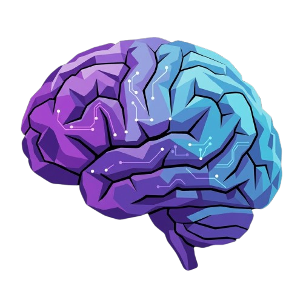

<div align="center">



# Your Second Brain: A Free, Local Multimodal Knowledge Visualisation & Semantic Retrieval Framework

<div align="center">
        
</div>

<div align="center">

<a href="https://github.com/officialadityadesai/yoursecondbrain/tree/main"></a>
<a href="https://ai.google.dev/gemini-api/docs/embeddings"></a>
<a href="https://lancedb.com"></a>

<a href="https://www.python.org/downloads/"></a>
<a href="https://vite.dev/"></a>
<a href="https://fastapi.tiangolo.com/"></a>
<a href="https://ffmpeg.org/"></a>

<a href="https://support.claude.com/en/articles/10949351-getting-started-with-local-mcp-servers-on-claude-desktop"></a>
<a href="https://opensource.org/license/mit"></a>

</div>

</div>

---

## 🎯 The Problem

**Hitting your AI/API usage limits mid-conversation and losing context about everything is the biggest problem with ChatGPT, Claude, Gemini, and other popular AI tools.** 

Current knowledge management tools like Notion, Obsidian, or Sticky Notes try to fix this, however, they still require you to manually organise, tag, and link everything yourself, and none of them can actually understand your files, search across different file types by describing content in them, or accurely answer questions from your content directly. You end up with a better organised mess, not a smarter one.

Every time you want to ask AI a question/request about your files, you re-upload the same context, prompts, and files over and over again. Your scarce token budget bleeds away. You can't see how the files relate. You risk hallucinations and context rot with every message you send. You're trapped in a cycle of re-uploading, re-explaining, and re-sending.

**With "Your Second Brain", these will be problems of the past.**

## 💡 Core Idea

**Upload your files once**.
The framework:
- **Centralises** them in a unified multimodal local vector database
- **Understands** them semantically across all modalities (text, images, video, documents, etc)
- **Allows** uploading context labels that shape embeddings and retrieval intent from the first upload
- **Visualises** relationships, ideas, and entities in an interactive nodal knowledge graph
- **Protects** memory quality with duplicate-name and duplicate-content blocking before ingest
- **Self-heals** old knowledg using startup backfills that enrich missing entities and video transcripts automatically
- **Retrieves** grounded answers and information only from your knowledge with neuron-level evidence
- **Integrates** with Claude MCP to find hidden information in files, retrieve trimmed timestamp-precise video clips, and get grounded answers from your knowledge base
- **Supports** dual chat intelligence with both Gemini and connected Claude account modes

This is a **generously feature-rich free framework that you can adapt** to your projects, workflows, product development, knowledge management, customer support, personal learning, and team collaboration initiatives. In practice, this means local, unlimited ingestion, a unified multimodal semantic space, node-focused knowledge visualisation, token-efficient retrieval assembly, and Claude MCP as a native memory interface with source-based answers.

## 🏗️ How It Works

```mermaid
%%{init: {'theme': 'base', 'themeVariables': {'primaryColor': '#1F2535', 'primaryTextColor': '#D7DBF4', 'primaryBorderColor': '#6E78BF', 'lineColor': '#7E6FAF', 'secondaryColor': '#181C27', 'tertiaryColor': '#12151C', 'background': '#0B0D12'}}}%%
flowchart LR
                Q[Your Files & Questions]:::entry

                subgraph S1[Stage 1: Ingestion]
                        U1[Upload Panel / brain_data folder]
                        U2[File Router by Type]
                        U3[Parse & Chunk]
                        U1 --> U2 --> U3
                end

                subgraph S2[Stage 2: Understanding]
                        E1[Semantic Embeddings]
                        E2[Entity & Topic Extraction]
                        E3[Video Transcription]
                        E1 --> E2
                        E1 --> E3
                end

                subgraph S3[Stage 3: Memory]
                        K1[Vector Index]
                        K2[Knowledge Graph]
                        K3[Citation Metadata]
                        K1 --> K2
                        K1 --> K3
                end

                subgraph S4[Stage 4: Retrieval & Action]
                        R1[Semantic Search]
                        R2[Chat with Citations]
                        R3[Claude MCP Tools]
                        R1 --> R2
                        R1 --> R3
                end

                Q --> U1
                U3 --> E1
                E2 --> K1
                K2 --> R1

                classDef entry fill:#2A3150,stroke:#8B79C4,color:#E6E9FF,stroke-width:2px;
```



**Process:**
1. Upload files (documents, images, videos) once.
2. System parses them, generates semantic embeddings, and extracts entities, topics, and ideas.
3. Everything is indexed and connected in a multimodal nodal knowledge graph.
4. Ask questions, and get answers grounded in your actual files with citations.
5. Use Claude MCP to extend it into your current AI operations.

## ✨ Core Capabilities

<div style="background: linear-gradient(135deg, #12151f 0%, #1d2230 100%); border-radius: 14px; padding: 22px; margin-top: 10px; border-left: 4px solid #6E78BF;">

- **Multimodal Ingestion Pipeline**: Upload text files, PDFs, Word docs, images, and videos together - the system processes them, regardless of mode, semantically without any setup changes per file type
- **Context-Steered Indexing**: Attach a label/caption to any upload batch describing what the files are for, and the system indexes them with that intent baked in, so searches return results that match your meaning, not just the words or pixels in the files
- **Nodal Knowledge Graph Visualisation**: Every file, concept, person, and relationship in your knowledge base is mapped as an interactive visual graph (Just like in Obsidian, but with almost any file type) you can explore and navigate, making it easy to see how ideas and files connect across your entire library
- **Semantic Retrieval**: Ask a question and the system searches by meaning across all file types at once, pulling the most relevant content whether it lives in a PDF, an image, or a video
- **Answers with Proof**: Every response in the chat comes with linked citations that open the exact source file and show you the specific passages the answer came from, so you can verify anything instantly without digging
- **Claude MCP Integration**: Connect your knowledge base directly to Claude Desktop so you can ask Claude questions about your files in natural language, retrieve exact, auto-trimmed video clips by describing what happens in them, and get answers grounded in your own content - without re-uploading anything
- **Video Clip Retrieval**: Upload a long video once and ask for specific moments in plain language. The system finds the right timestamp and returns a trimmed, playable clip - no manual scrubbing needed
- **Brain Dump Workspace**: Write notes directly in the app and they are automatically indexed into your knowledge base, searchable, and connected in the graph alongside your uploaded files
- **Self-Maintaining Knowledge**: The system detects files that are missing entities or metadata and enriches them automatically in the background, so your knowledge base stays complete without any manual re-processing
- **Local, Private, and Free to Run**: Everything runs on your machine at no cost beyond your free Gemini API key. No files leave your computer, no content is indexed externally, and nothing needs to be re-uploaded between sessions

</div>

This framework is adaptable across business documents/IP, SOPs, research, studying, customer support, personal knowledge management, team collaboration, media analysis, and compliance-heavy workflows where persistent multimodal retrieval and explainable evidence matter.

### IMPORTANT NOTE

**The most advanced query capabilities (semantic video clip finding, holistic retrieval, and deep entity tracing) run through Claude Desktop MCP, not the built-in Gemini chat pane.** 

Setup instructions are in the Quick Start and Manual Installation sections below.

## 🚀 Quick Start

The easiest way to get set up. Claude Code walks you through every step. You only need to answer two questions (Docker ready? and your Gemini API key). Everything else is handled for you.

### What you need

**A Claude plan that includes Claude Code** (Pro, Max, Team, or Enterprise). Claude Code is not available on the free plan. Check your plan at [claude.ai](https://claude.ai) or upgrade at [claude.ai/upgrade](https://claude.ai/upgrade).

If you don't have a paid Claude plan, use the Manual Installation section below.

### Get Claude Code

Claude Code works as a VS Code extension:

1. Open VS Code
2. Press `Ctrl+Shift+X` (Windows) or `Cmd+Shift+X` (Mac) to open Extensions
3. Search for **Claude Code** and click **Install**
4. Click the Claude Code icon in the sidebar and sign in with your Anthropic account

### Run the setup

Open Claude Code, start a new conversation, and paste this prompt:

```
Clone this repo: https://github.com/officialadityadesai/yoursecondbrain - then read the CLAUDE-CODE-BLUEPRINT.md file in the root of the cloned repo and follow every step in it exactly to set up the app on my computer. Walk me through anything you need from me in plain English.
```

Claude Code will guide you through installing Docker Desktop (the only prerequisite), cloning the repo, setting up your API key, starting the app, and wiring up Claude Desktop MCP. When it's done, open **http://localhost:8000** and your second brain is ready.

## 🛠️ Manual Installation

No programming knowledge required. The only thing you install is Docker Desktop, which is a free app that handles all the "backend" for you automatically. Follow every step below exactly as written.

**Works on Windows, MacOS, and Linux.**

---

### Step 1 - Install Docker Desktop

Docker Desktop is a free app that runs Your Second Brain for you. You don't need to install Python, Node.js, or anything else - Docker handles all of that inside itself.

1. Go to **https://www.docker.com/products/docker-desktop/** in your browser
2. Click the download button for your operating system (Windows or Mac)
3. Once the file downloads, open it and run the installer
   - Windows: double-click the `.exe` file and follow the prompts. When it asks you to restart your computer, click yes and let it restart.
   - Mac: open the `.dmg` file, then drag the Docker icon into your Applications folder. Open Docker from your Applications folder and follow the setup prompts.
4. After your computer restarts (Windows) or after opening Docker (Mac), wait for Docker Desktop to finish starting up. You'll know it's ready when:
   - Windows: a small whale icon appears in the bottom-right of your taskbar (in the system tray). If you don't see it, click the little arrow `^` in the taskbar to show hidden icons.
   - Mac: a whale icon appears in the menu bar at the top of your screen.
5. Click that whale icon and make sure it says **"Docker Desktop is running"**. If it's still starting up, wait another minute and check again.

Once you see "Docker Desktop is running", you're ready for the next step.

---

### Step 2 - Download the App Files

You need to download the app's files onto your computer. You'll do this using a terminal (a text-based window where you type commands).

**How to open a terminal:**
- Windows: press the Windows key, type `PowerShell`, and click **Windows PowerShell** to open it
- Mac: press `Cmd + Space`, type `Terminal`, and press Enter to open it

Once your terminal is open, copy and paste the command below for your operating system.

**Windows:**
```powershell
git clone https://github.com/officialadityadesai/yoursecondbrain.git "$env:USERPROFILE\yoursecondbrain"
```

**Mac:**
```bash
git clone https://github.com/officialadityadesai/yoursecondbrain.git ~/yoursecondbrain
```

Press Enter. You'll see some text appear as the files download. Wait for it to finish. You'll know it's done when a new line appears with a blinking cursor waiting for your next command.

**If you see an error saying `git` is not recognised or not found:**
- Windows: go to https://git-scm.com/download/win, download the installer, run it with all default settings, then close and reopen PowerShell and try the command again
- Mac: a popup will appear asking you to install developer tools — click Install, wait for it to finish, then try the command again

---

### Step 3 - Navigate Into the App Folder

After downloading, you need to tell the terminal to work inside the app folder you just downloaded. Copy and paste this command:

**Windows:**
```powershell
cd "$env:USERPROFILE\yoursecondbrain"
```

**Mac:**
```bash
cd ~/yoursecondbrain
```

Press Enter. The terminal is now pointed at your app folder. Keep this terminal open as you'll need it for the next steps.

---

### Step 4 - Get Your Free Gemini API Key

The app uses Google's Gemini AI to understand and search your files. You need a free API key (think of it as a password that lets the app use Gemini).

1. Go to **https://aistudio.google.com/app/apikey** in your browser
2. Sign in with a Google account
3. If you get redirected to a page about account verification instead of the API key page, look for a blue link that says **"verified your age"** and click it. Follow the steps to verify your age with Google, then go back to the API key link above.
4. Click **Create API key**
5. A long key will appear. Click the copy button next to it to copy it. Keep this browser tab open as you'll need to paste this key in the next step.

---

### Step 5 - Add Your API Key to the App

The app reads its settings from a file called `.env`. You need to create that file and put your API key in it.

**Windows:**

1. In your PowerShell window, paste this command and press Enter:
```powershell
Copy-Item .env.example .env
```
2. Now open the file in Notepad by pasting this command and pressing Enter:
```powershell
notepad .env
```
3. Notepad will open. You'll see a line that says `GEMINI_API_KEY=`. Click at the end of that line (after the `=` sign) and paste your API key there so it looks like:
```
GEMINI_API_KEY=AIzaYourKeyHere
```
4. Press File, then Save As, then save it as ".env". Delete the old ".env.example" file.

**Mac:**

1. In your Terminal window, paste this command and press Enter:
```bash
cp .env.example .env
```
2. Now open the file in TextEdit by pasting this command and pressing Enter:
```bash
open -e .env
```
3. TextEdit will open. You'll see a line that says `GEMINI_API_KEY=`. Click at the end of that line (after the `=` sign) and paste your API key there so it looks like:
```
GEMINI_API_KEY=AIzaYourKeyHere
```
4. Press `Cmd + S` to save, then close TextEdit.

---

### Step 6 - Start the App

Make sure Docker Desktop is still running (the whale icon is visible in your taskbar or menu bar). Then, in your terminal, paste this command and press Enter:

```
docker compose up -d
```

This tells Docker to download and start the app. The first time you run this, it will download the app — this takes roughly 3-5 minutes depending on your internet speed. You'll see a lot of text scrolling past, which is normal. When it's finished, you'll see a line that says something like `Container yoursecondbrain... Started` and then a new blinking cursor.

To confirm the app is running, open your browser and go to:

**http://localhost:8000**

You should see the Your Second Brain app open. If it loads, you're all set.

> From now on, you never need to run this command again. Every time you start your computer and Docker Desktop opens, the app starts automatically in the background. Just go to http://localhost:8000 whenever you want to use it.

---

### Step 7 - Set Up Claude Desktop MCP

This step connects your knowledge base to the Claude Desktop app so you can ask Claude questions about your files directly in any Claude chat, get cited answers from your own content, and even retrieve trimmed video clips just by describing what's in them.

> This requires the **Claude Desktop app** (the downloadable app from https://claude.ai/download), not the Claude website. **The website cannot connect to local tools like this.**

**First, install Claude Desktop if you haven't already:**
1. Go to **https://claude.ai/download**
2. Download and install the app for your OS
3. Open Claude Desktop and sign in with your Anthropic account

**Then connect it to your knowledge base:**

Claude Desktop has a built-in config file where you tell it which tools to connect to. You're going to add Your Second Brain to that file.

1. Open Claude Desktop
2. Click **Claude** in the top menu bar (Mac) or the hamburger menu (Windows), then go to **Settings**
3. Click the **Developer** tab
4. Click **Edit Config** — this opens a file called `claude_desktop_config.json` in a text editor

The file will either be empty or already have some content in it. Either way, you need to add the Your Second Brain entry inside the `"mcpServers"` section.

**If the file is empty**, paste in the entire block below:

```json
{
  "mcpServers": {
    "my-second-brain": {
      "command": "PYTHON_PATH",
      "args": ["REPO_PATH\\backend\\mcp_server.py"]
    }
  }
}
```

**If the file already has content**, find the `"mcpServers": {` line and add the `"my-second-brain"` entry inside it alongside anything already there. Only add what's inside the curly braces - don't replace the whole file.

You need to replace two placeholders in that block:

- `PYTHON_PATH` — the full path to Python on your computer
- `REPO_PATH` — the full path to the yoursecondbrain folder

**To find your Python path:**

- Windows: open PowerShell and run `where python` — copy the path it prints (e.g. `C:\Users\YourName\AppData\Local\Programs\Python\Python313\python.exe`)
- Mac: open Terminal and run `which python3` — copy the path it prints (e.g. `/usr/local/bin/python3`)

**To find your repo path:**

- Windows: open PowerShell, run `cd "$env:USERPROFILE\yoursecondbrain"` then run `cd` and copy the path it prints (e.g. `C:\Users\YourName\yoursecondbrain`)
- Mac: open Terminal, run `cd ~/yoursecondbrain` then run `pwd` and copy the path it prints (e.g. `/Users/YourName/yoursecondbrain`)

Once you've replaced both placeholders, the entry should look something like this (your actual paths will be different):

**Windows example:**
```json
{
  "mcpServers": {
    "my-second-brain": {
      "command": "C:\\Users\\YourName\\AppData\\Local\\Programs\\Python\\Python313\\python.exe",
      "args": ["C:\\Users\\YourName\\yoursecondbrain\\backend\\mcp_server.py"]
    }
  }
}
```

**Mac example:**
```json
{
  "mcpServers": {
    "my-second-brain": {
      "command": "/usr/local/bin/python3",
      "args": ["/Users/YourName/yoursecondbrain/backend/mcp_server.py"]
    }
  }
}
```

> On Windows, every backslash in a path must be written as two backslashes (`\\`) inside the JSON file. This is normal — don't remove them.

Save the file once you're done.

**Finally, fully quit and reopen Claude Desktop:**

Closing the window is not enough. You need to fully quit it and reopen it:
- Windows: find the Claude icon in the bottom-right of your taskbar (click the `^` arrow if you don't see it), right-click it, and click **Quit**. Then, open Task Manager, search Claude, right click Claude, then click "Quit". Then reopen Claude Desktop from the Start menu.
- Mac: press **Cmd + Q** while Claude Desktop is the active window. Then reopen it from your Applications folder.

Once Claude Desktop is back open, go to **Settings > Developer** and you should see **my-second-brain** listed there with a blue "running" status indicator. That means it's connected and working.

---

### Step 8 - Verify Everything Works

- Open **http://localhost:8000** in your browser and confirm the knowledge graph loads
- Open Claude Desktop, go to **Settings > Developer**, and confirm **my-second-brain** is listed

Setup is complete. Your knowledge base is ready to use.

---

### Day-to-Day Usage

Once set up, you don't need to do anything. The app runs automatically every time Docker Desktop starts, which itself starts when you log in to your computer. Just open http://localhost:8000 or use Claude Desktop.

| Task | How |
|---|---|
| Open the app | Go to http://localhost:8000 in your browser |
| Stop the app | Open your terminal, navigate to the app folder, and run `docker compose down` |
| Start it again manually | Run `docker compose up -d` in the app folder |
| Update to a newer version | Run `docker compose pull && docker compose up -d` in the app folder |

Your uploaded files and your entire knowledge base are stored in the `yoursecondbrain` folder on your computer. They are never deleted when you stop or update the app.

---

### Troubleshooting

**The page at http://localhost:8000 won't load**

Make sure Docker Desktop is open and running (look for the whale icon). If Docker is running but the page still won't load, open your terminal, navigate to the app folder, and run:
```
docker compose logs
```
This shows what's happening inside the app. The most common cause is a missing or incorrect API key in the `.env` file — go back to Step 5 and double-check the key was saved correctly with no extra spaces.

**The app started but shows a JSON error instead of the UI**

Run this in your terminal from the app folder:
```
docker compose pull && docker compose up -d
```
This updates the app to the latest version.

**Port 8000 is already in use**

Something else on your computer is using port 8000. Open `docker-compose.yml` in a text editor, find the line that says `"8000:8000"` and change it to `"8001:8000"`, save the file, then run `docker compose up -d` again. Access the app at http://localhost:8001 instead.

**The hammer icon is not showing in Claude Desktop**

Make sure you fully quit Claude Desktop (not just closed the window) and reopened it. On Windows, use the system tray icon to Quit. On Mac, use Cmd+Q. Then open a fresh chat and look for the hammer icon again.

## 🧩 Supported Content Types

| Category | Formats |
|---|---|
| Documents | .pdf .docx .txt .md |
| Images | .png .jpg .jpeg .webp |
| Videos | .mp4 .mov .avi .mkv |

## 🛠️ Tech Stack

| Layer | Technology |
|---|---|
| Backend API | FastAPI + Uvicorn |
| Auth & Token Storage | Claude OAuth + OS keyring |
| Vector Database | LanceDB |
| Embeddings | Gemini Embedding 2 (1536-dim) |
| Ingestion | PyMuPDF, python-docx, Mammoth, OpenCV, FFmpeg |
| File Watcher | watchdog |
| Frontend | React 19 + Vite + Axios + React Markdown |
| Graph Engine | react-force-graph-2d |
| MCP Server | mcp + FastMCP |

## 🗂️ Project Layout

```text
yoursecondbrain/
├── backend/
│   ├── main.py
│   ├── ingest.py
│   ├── db.py
│   └── mcp_server.py
├── frontend/
│   └── src/components/
│       ├── ChatInterface.jsx
│       ├── FileManager.jsx
│       ├── KnowledgeGraph.jsx
│       ├── PreviewModal.jsx
│       └── BrainDumpWorkspace.jsx
├── brain_data/
├── scripts/
├── install.bat
└── run.bat
```

## 📄 License

MIT

---

<div align="center" style="margin-top: 16px;">
        <a href="https://www.instagram.com/officialadityadesai/">
                
        </a>
</div>
